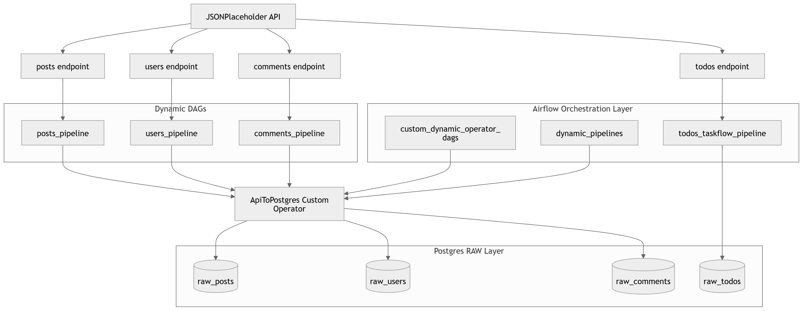

# Airflow Orchestration Lab

A modular Apache Airflow project demonstrating multiple workflow patterns for building scalable data pipelines.

## 🚀 Overview

This project simulates a real-world data orchestration system using multiple Airflow paradigms:

- TaskFlow API DAGs (modern style)
- Dynamic DAG generation
- Custom Operators
- Trigger-based orchestration
- PostgreSQL RAW data layer

All pipelines ingest data from public APIs and load it into Postgres.

---

## 🏗️ Architecture



---

## ⚙️ Pipeline Types

### 1. TaskFlow API Pipeline
- `todos_taskflow_pipeline`
- Extracts and loads todos into Postgres RAW layer

### 2. Dynamic DAGs
- Automatically generate DAGs from configuration
- Used for:
  - posts
  - users
  - comments

### 3. Custom Operator Pipeline
- Reusable `ApiToPostgresOperator`
- Handles:
  - API extraction
  - table creation
  - idempotent inserts

### 4. Orchestration DAGs
- Trigger downstream DAGs after completion

---

## 🧱 Tech Stack

- Apache Airflow
- Python
- Postgres
- Docker
- REST APIs (JSONPlaceholder)

---

## 📦 Data Sources

- https://jsonplaceholder.typicode.com/posts
- https://jsonplaceholder.typicode.com/users
- https://jsonplaceholder.typicode.com/comments
- https://jsonplaceholder.typicode.com/todos

---

## 🧠 Key Concepts Implemented

- DAG creation & scheduling
- TaskFlow API
- Dynamic DAG generation
- Custom Operators
- XCom usage (implicit via TaskFlow)
- Sensors (basic)
- TriggerDagRunOperator
- Idempotent loading (ON CONFLICT)
- RAW layer data modeling

---

## ▶️ Run Locally

```bash
docker-compose up -d
```

Access Airflow UI:
```
http://localhost:8080
```

---

## 📊 Output Tables

- raw_posts
- raw_users
- raw_comments
- raw_todos

---

## 📌 Purpose

This project was built as a learning system to understand:

- Airflow orchestration patterns
- Data pipeline design
- Production-style DAG structuring
- API ingestion workflows

---

## ⭐ Status

Learning sandbox → evolving into portfolio-grade data engineering project
